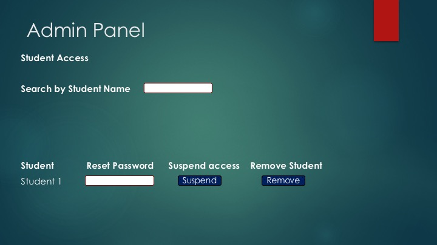
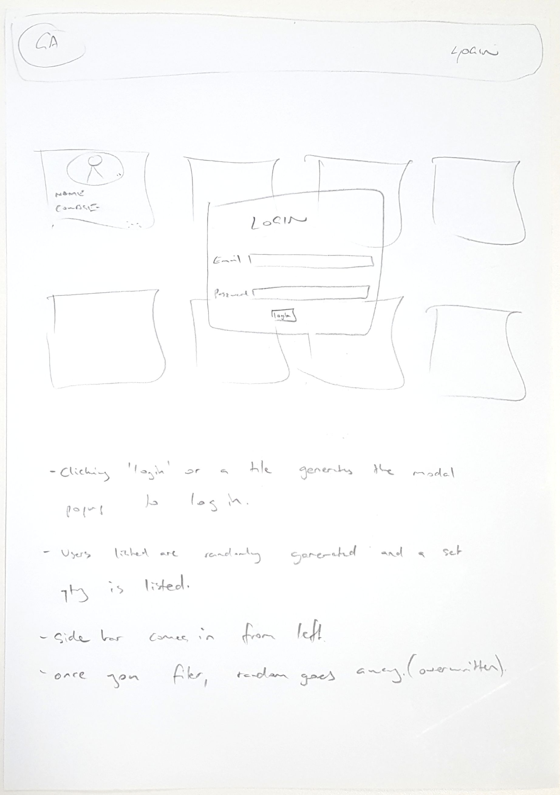

# GA-CONNECT

Meet and collaborate with fellow General Assembly students on building startups, projects for your portfolio, or simply to network by utilising a student GA Connect directory which outlines skills, courses, and goals.

##### [Installation](#installation) | [Our Approach](#our-approach) | [Personas & User Stories](#personas-and-user-stories) | [Wireframes](#wireframes) | [Past & Future Challenges](# challenges-and-reflection) | [Technologies Used](#technologies-used) | [Contributors](#contributors) | [Licence](#licence)

## Installation
You can find a working demo of GA Connect on [github](https://stephenkoo.github.io/GA-Connect-Front/public/index.html), and the repo also on [github](https://github.com/stephenkoo/GA-Connect-Front). The origin front-end repo can be found [here](https://github.com/stephenkoo/GA-Connect-Backbone), which is now redundant.
The backend is hosted on [Heroku](https://historic-kings-canyon-91668.herokuapp.com/api).

To install the back-end locally:

1. Go to a directory on your terminal and type: git clone <add repository URL here>
2. In your terminal type: npm install
3. In the file server.js, change the Mongoose connection to a local MongoDB on your computer
4. You can now utilise the API locally at http://localhost:8080, however there will be no data in your database
5. Follow the instructions below to add users to your database
6. If you deploy the API to Heroku, you will need to set-up your own mLab database and change the mongoose connection accordingly

To install the front-end locally:

1. Go to a directory on your terminal and type: git clone <add repository URL here>
2. In your terminal type: npm install
3. Use the full URL to /public/index.html and open it in your browser
4. Ensure the connection /public/js/user.js matches your locally hosted database

### How to use the API
The API features full CRUD functionality.

To register, submit a POST request to https://historic-kings-canyon-91668.herokuapp.com/api/register with the following fields:

* firstName
* lastName
* email
* password

A JSON web token will be rendering on screen. This needs to be included in your header when submitting further requests to update your own profile.

To create your own profile, submit a POST request to https://historic-kings-canyon-91668.herokuapp.com/api/profile with the following fields:

* profileActive - Boolean
* headline - String
* elevatorPitch - String
* goals - String
* skills - [Strings inside an array]
* portfolioURL - String
* linkedinURL - String
* country - String
* city - String
* course - [courseName - String, courseStart - Date, courseEnd - Date]

To update the profile, submit a PUT request to https://historic-kings-canyon-91668.herokuapp.com/api/profile with the fields you wish to change.

To view your own profile, submit a GET request to https://historic-kings-canyon-91668.herokuapp.com/api/profile

To delete your own profile, submit a DELETE request to https://historic-kings-canyon-91668.herokuapp.com/api/profile

To view your User page, submit a GET request to https://historic-kings-canyon-91668.herokuapp.com/api/user

All users can be retrieved by submitting a GET request (no JSON web token required) to https://historic-kings-canyon-91668.herokuapp.com/api/users

All profiles can be retrieved by submitting a GET request (no JSON web token required) to https://historic-kings-canyon-91668.herokuapp.com/api/profiles

You can also perform a search to view all profiles that contain a specific city, course, goal or skill. These can be retrieved by submitting a GET request to the following URLS:

* https://historic-kings-canyon-91668.herokuapp.com/api/search/city/:city
* https://historic-kings-canyon-91668.herokuapp.com/api/search/course/:course
* https://historic-kings-canyon-91668.herokuapp.com/api/search/goals/:goal
* https://historic-kings-canyon-91668.herokuapp.com/api/search/skills/:skill

## Our Approach
We first identified that a personal pain that we felt as GA students that we wanted to solve was the limited opportunities we had to collaborate and get to know other GA students, particular UX design students.

We then discussed potential technological solutions, and came up with the idea of a GA-exclusive social platform focused on matching students across courses who share common goals. After brainstorming several personas and speaking to potential stakeholders and users, we wrote several user stories inspired by our learnings to fully flesh out the functions that users require in this website.

Utilising a three man team we split up the work but assisted each other when required. Brad set up the API and the GridFS to store the profile pictures and assisted with the mockups. Stephen worked on the client interface and assisted with the mockups. Luke managed the authentication and provided significant assistance to Stephen and Brad.

### How we divided labour
Brad built the API (utilising online tutorials and class material) and had trouble with the routes mainly due to finding the right syntax (which was solved by searching Google, talking to classmates and the instructors).
Luke assisted with the routes and developed the authentication for user registration, logins and JSON web tokens.
Stephen built a static client and then focussed on working with Luke to utilise Backbone to improve the user experience.
Brad assisted the team in finding a suitable script to access the API (obtained from a Google search) from the front end but could not get it to work with authentication switched on. He then passed this on to Luke who solved this problem by reducing the authenciation requirements on most API routes.
We had working parts but needed to put it all together so Luke and Stephen worked on the Backbone while Brad continued to work on integrating the pictures into the profiles. Brad tried to seed the data but was unsuccessful so he used the mongoimport commands to insert the GridFs files into mongo and then linked them to the userProfile model using db.userProfile.update.

## Personas and user stories
We created 3 personas to flesh out the specific needs for each type of user GA Connect is intended to serve.

- **Mark the networker:** Mark is a Product Management student who just started building his startup. He'd like to network with other entrepreneurial GA students so they can share their journey together and provide each other helpful advice.
- **Bill the job hunter:** Bill is a Web Development Immersive student who has almost completed the course who wants to get a job as a junior web developer in the startup Orange Bubble. He'd like to continue meeting up with other WDI students after the course to work together on building their portfolios, on their CVs, practice interviews and keep each other accountable for attending networking events.
- **Adam the startup builder:** Adam is a Web Development Immersive student looking for one UX Design Immersive student and one Product Management student to build a startup together.
- **Emily the administrator:** Emily is a GA administrator responsible for the management of students and classes. She wants to encourage GA students across courses to get to know each other better.

Check out [GA Connect"s user stories Trello](https://trello.com/b/youoepjC/).

## Wireframes
Using user stories to flesh out the requirements for each persona.

### Draft for persona Adam & Mark

#### Main page

#### Sidebar function

#### Profile page

#### Profile edit pages

*- Sketched by Stephen.*

### Draft for persona Bill

#### Profile page

#### Chat function

#### Chat conversation

*- Sketched by Luke.*

### Draft for persona Emily

#### Admin create user page

#### Admin search & delete page

*- Designed by Brad.*

### Synthesised wireframes

#### Home page

#### Logged in page with sidebar

#### Profile page

*- Sketched by Luke.*

## Working functionality and future functions to implement
We focused our time building a full-fledged backend API with a database authentication system for future account creation so users can edit their own profiles.

On the front-end, we successfully used Backbone.js to develop a single page application which reads our API to render elements on the page such as user profile cards and user profile pages.

Other functions we worked on but have not yet completed include:

- The ability to create accounts and log in.
- The ability to edit your own profile once signed in.
- Using gridfs to implement user image uploading to add their own profile pictures. (CRUD functionality with Backbone in a SPA.)
- Develop working sidebar filter options which filters results shown.

## Challenges & Reflection

### Brad
Working together was good as we set clearly defined roles and helped one another when it was required.
As usual we had more grandiose plans than what we could deliver in the time allocated.

### Luke
Generating web tokens that are applicable to a particular user was tricky. I solved it by attaching the user id with a token during its creation. That way, the middleware authentication was able to identify the user using the token that was issued.

We spent the majority of our allocated time building the backend API in tandem with a front-end design that only utilised fake data. Given how long it took to build the backend API with full CRUD functionality, we decided to work on the front end one step at a time. At this stage, this means READING from the API only. The next step would be filtering the READ data, then being able to CREATE, UPDATE and DELETE, in tandem with a user authentication system.

### Stephen
Stephen: The biggest challenges for me were building a working Backbone framework which extracted data from the API correctly. Lots of time reviewing router.js, cardView.js and indexView.js to troubleshoot points which wasn't working correctly.

The second largest challenge was getting the page elements to display correctly when using a front-end web frameworks like Foundation. Sometimes you have no idea whether you should be overwriting a CSS property in Foundation or if your own SCSS is causing a page element to be out of position.

I would like to really get familiar with using Foundation properly for rapid development so that in the future it becomes a tool that accelerates front-end development, instead of slow it down.

## Technologies Used

- **MEBN stack:** MongoDB | Express | Backbone.js/Angular | Node.js
- API hosted on Heroku
- **Node modules:**

**[Dependencies for the backend]**
"body-parser": "~1.0.1",
"cors": "^2.7.1",
"ejs": "^2.4.2",
"express": "^4.14.0",
"express-jwt": "^3.4.0",
"gridfs-stream": "^1.1.1",
"jsonwebtoken": "^7.0.1",
"method-override": "^2.3.6",
"mongoose": "^4.5.1",
"morgan": "^1.7.0",
"node-mongo-seeds": "^2.2.9",
"passport": "^0.3.2",
"passport-local": "^1.0.0",

**[Dependencies for the front-end]**
"foundation-sites": "^6.2.3",
"motion-ui": "^1.2.2"

## Contributors

[Brad Wynter](https://github.com/brawyn77/) | [Luke Phelan](https://github.com/lukephelan/) | [Stephen Koo](https://github.com/stephenkoo/)

- Credit to Brad for doing real customer development and talking to GA staff to identify their goals and needs.

## Licence
Lincensed under the [MIT Licence](https://opensource.org/licenses/MIT).
